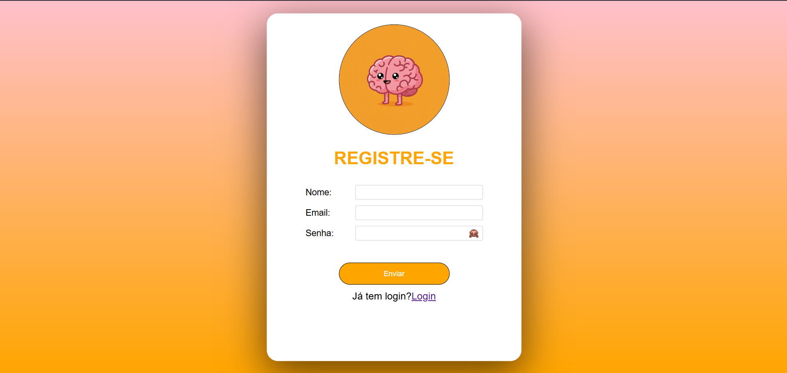

<h1>PROJETO - GÊNIO QUIZ</h1>

Objetivo desse projeto, para crianças do quinto ao sexto ano, é estimular o aprendizado escolar de forma eficiente e com competividade entre os alunos. As perguntas do projetos são totalmente moduláveis, basta adicionar ao banco de dados

<h1>A primeira tela do jogo:</h1>

